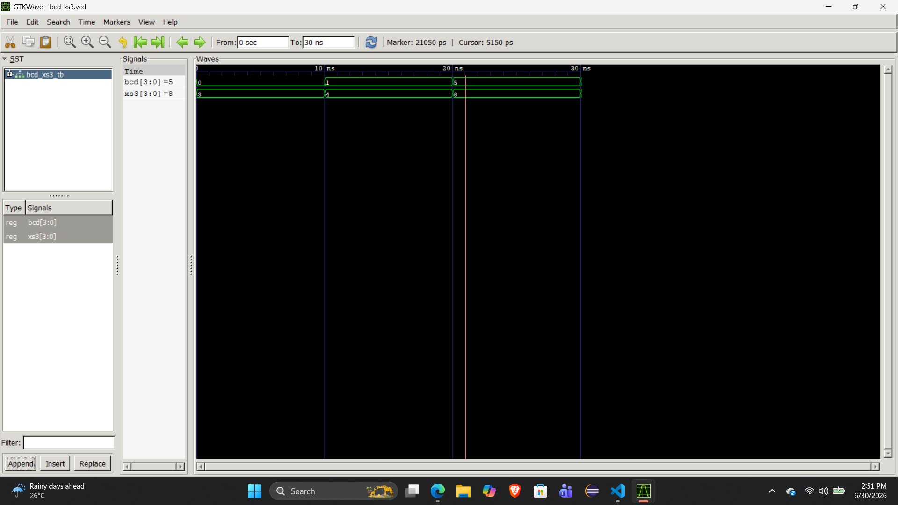
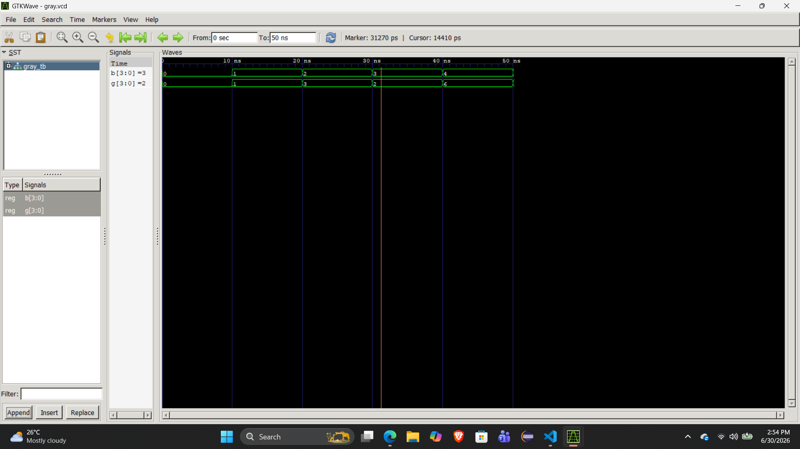

# Lab 6: VHDL Code for Combinational Circuits – Code Converters

## Objective
* To design and simulate a **BCD-to-Excess-3** code converter in VHDL.
* To design and simulate a **Binary-to-Gray** code converter in VHDL.

---

## Theory & Logic Design

### 1. BCD to Excess-3 Converter
Excess-3 (XS-3) is a non-weighted code obtained by adding 3 ($0011_2$) to each Binary Coded Decimal (BCD) digit. It is a **self-complementing** code, which simplifies subtraction operations in digital arithmetic circuits.

#### Truth Table
| Decimal | BCD Input (D C B A) | Excess-3 Output (W X Y Z) |
| :---: | :---: | :---: |
| 0 | 0000 | 0011 |
| 1 | 0001 | 0100 |
| 2 | 0010 | 0101 |
| 3 | 0011 | 0110 |
| 4 | 0100 | 0111 |
| 5 | 0101 | 1000 |
| 6 | 0110 | 1001 |
| 7 | 0111 | 1010 |
| 8 | 1000 | 1011 |
| 9 | 1001 | 1100 |

---

### 2. Binary to Gray Code Converter
Gray code is an unweighted, cyclic code where two successive values differ by **only one bit**. This property minimizes errors during state transitions, making it highly useful in rotary encoders, optical encoders, and asynchronous clock domain crossings (FIFOs).

#### Conversion Rule
* The Most Significant Bit (MSB) of the Gray code is identical to the MSB of the Binary code.
* For all subsequent bits, the $i$-th Gray bit is obtained by XORing the $i$-th and $(i+1)$-th Binary bits:
  $$G_i = B_i \oplus B_{i+1}$$

#### Truth Table (4-Bit Example)
| Decimal | Binary Input ($B_3 B_2 B_1 B_0$) | Gray Output ($G_3 G_2 G_1 G_0$) |
| :---: | :---: | :---: |
| 0 | 0000 | 0000 |
| 1 | 0001 | 0001 |
| 2 | 0010 | 0011 |
| 3 | 0011 | 0010 |
| 4 | 0100 | 0110 |
| 5 | 0101 | 0111 |
| 6 | 0110 | 0101 |
| 7 | 0111 | 0100 |
| 8 | 1000 | 1100 |
| 9 | 1001 | 1101 |
| 10 | 1010 | 1111 |
| 11 | 1011 | 1110 |
| 12 | 1100 | 1010 |
| 13 | 1101 | 1011 |
| 14 | 1110 | 1001 |
| 15 | 1111 | 1000 |

### Output
# For BCD to XS3

# For BCD to Gray

## Discussion and Conclusion
In this lab, we designed and tested two distinct code converters using VHDL:
1. **BCD-to-Excess-3 Converter:** This was implemented using behavioral modeling. By using an `if-else` statement combined with type casting (`unsigned`), we easily added a binary 3 ($0011$) to the inputs. Inputs above 9 were treated as invalid BCD states.
2. **Binary-to-Gray Converter:** This was implemented using dataflow modeling. It directly mapped out the bitwise XOR logic ($G_i = B_i \oplus B_{i+1}$). The simulation confirmed that the output always changed by exactly one bit at a time, preventing transition errors.
We successfully designed, simulated, and verified a 4-bit BCD-to-Excess-3 code converter and a Binary-to-Gray code converter using VHDL. The experiment confirmed how different combinational logic setups (behavioral arithmetic vs. direct logic gates) can be used to alter data representations for digital applications like error minimization and digital arithmetic.